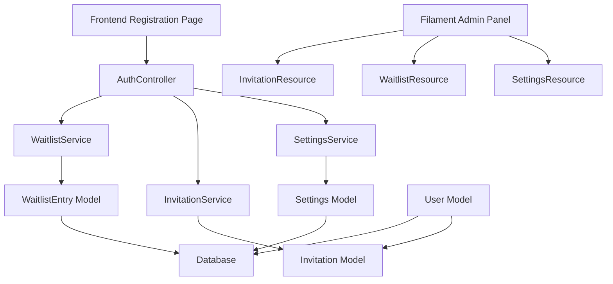

# Design Document

## Overview

The Dynamic Invite-Only System is designed as a flexible, toggle-based registration control mechanism that integrates seamlessly with the existing Laravel/Filament architecture. The system provides three distinct registration modes: invite-only with waitlist, invite-only with direct registration, and open registration.

The design follows the existing patterns in the codebase, utilizing Laravel's migration system, Eloquent models, API controllers, Filament resources, and service classes for business logic.

## Architecture

### System Components



### Data Flow

1. **Settings Check**: All registration attempts first check the global `invite_only_enabled` setting
2. **Route Determination**: Based on setting and presence of invitation code, system determines registration flow
3. **Validation**: Appropriate validation rules applied based on registration mode
4. **Processing**: User creation with invitation tracking or waitlist entry creation

## Components and Interfaces

### Database Schema

#### Settings Table
```sql
CREATE TABLE settings (
    id BIGSERIAL PRIMARY KEY,
    key VARCHAR(255) UNIQUE NOT NULL,
    value TEXT,
    created_at TIMESTAMP,
    updated_at TIMESTAMP
);
```

#### Invitations Table
```sql
CREATE TABLE invitations (
    id BIGSERIAL PRIMARY KEY,
    code VARCHAR(255) UNIQUE NOT NULL,
    inviter_user_id BIGINT REFERENCES users(id) ON DELETE CASCADE,
    recipient_user_id BIGINT REFERENCES users(id) ON DELETE SET NULL,
    status VARCHAR(50) DEFAULT 'pending',
    expires_at TIMESTAMP NULL,
    created_at TIMESTAMP,
    updated_at TIMESTAMP
);
```

#### Waitlist Entries Table
```sql
CREATE TABLE waitlist_entries (
    id BIGSERIAL PRIMARY KEY,
    email VARCHAR(255) UNIQUE NOT NULL,
    status VARCHAR(50) DEFAULT 'pending',
    invited_at TIMESTAMP NULL,
    created_at TIMESTAMP,
    updated_at TIMESTAMP
);
```

### Models

#### Settings Model
```php
class Settings extends Model
{
    protected $fillable = ['key', 'value'];
    
    public static function get(string $key, $default = null)
    public static function set(string $key, $value): void
    public static function toggle(string $key): bool
}
```

#### Invitation Model
```php
class Invitation extends Model
{
    protected $fillable = ['code', 'inviter_user_id', 'recipient_user_id', 'status', 'expires_at'];
    protected $casts = ['expires_at' => 'datetime'];
    
    public function inviter(): BelongsTo
    public function recipient(): BelongsTo
    public function isValid(): bool
    public function markAsAccepted(User $user): void
    public static function generateUniqueCode(): string
}
```

#### WaitlistEntry Model
```php
class WaitlistEntry extends Model
{
    protected $fillable = ['email', 'status', 'invited_at'];
    protected $casts = ['invited_at' => 'datetime'];
    
    public function markAsInvited(): void
    public function scopePending($query)
}
```

### Services

#### SettingsService
```php
class SettingsService
{
    public function isInviteOnlyEnabled(): bool
    public function toggleInviteOnly(): bool
    public function getPublicSettings(): array
    private function getCachedSetting(string $key, $default = null)
    private function setCachedSetting(string $key, $value): void
}
```

#### InvitationService
```php
class InvitationService
{
    public function generateInvitation(User $inviter, ?Carbon $expiresAt = null): Invitation
    public function validateInvitationCode(string $code): ?Invitation
    public function acceptInvitation(string $code, User $user): bool
    public function getUserInvitations(User $user): Collection
    public function cleanupExpiredInvitations(): int
}
```

#### WaitlistService
```php
class WaitlistService
{
    public function addToWaitlist(string $email): WaitlistEntry
    public function isEmailOnWaitlist(string $email): bool
    public function getPendingEntries(): Collection
    public function inviteFromWaitlist(string $email): ?Invitation
}
```

### API Endpoints

#### Public Endpoints
- `GET /api/settings/public` - Get public settings (invite-only status)
- `POST /api/waitlist` - Add email to waitlist

#### Authenticated Endpoints
- `POST /api/invitations` - Generate invitation code
- `GET /api/invitations` - List user's sent invitations
- `DELETE /api/invitations/{id}` - Revoke invitation

#### Modified Endpoints
- `POST /api/register` - Enhanced with invitation validation

### Frontend Components

#### Registration Page States
1. **Invite-Only + No Code**: Waitlist signup form
2. **Invite-Only + Valid Code**: Full registration form
3. **Open Registration**: Standard registration form

#### Invitation Management Page
- Generate new invitations
- View sent invitations with status
- Copy invitation links
- Revoke unused invitations

### Filament Resources

#### SettingsResource (Custom Page)
- Toggle for invite-only mode
- System settings overview
- Access restricted to Super Admins

#### WaitlistResource
- Table view of all waitlist entries
- Bulk actions for inviting users
- Export functionality
- Status filtering

#### InvitationResource (Optional)
- View all system invitations
- Admin oversight of invitation usage
- Cleanup expired invitations

## Data Models

### Settings Entity
```
Settings {
  id: bigint (PK)
  key: string (unique)
  value: text
  created_at: timestamp
  updated_at: timestamp
}
```

### Invitation Entity
```
Invitation {
  id: bigint (PK)
  code: string (unique, indexed)
  inviter_user_id: bigint (FK -> users.id)
  recipient_user_id: bigint (FK -> users.id, nullable)
  status: enum('pending', 'accepted', 'expired', 'revoked')
  expires_at: timestamp (nullable)
  created_at: timestamp
  updated_at: timestamp
}
```

### WaitlistEntry Entity
```
WaitlistEntry {
  id: bigint (PK)
  email: string (unique, indexed)
  status: enum('pending', 'invited')
  invited_at: timestamp (nullable)
  created_at: timestamp
  updated_at: timestamp
}
```

## Error Handling

### Validation Errors
- Invalid invitation codes return 422 with clear error messages
- Duplicate waitlist emails handled gracefully
- Expired invitations rejected with appropriate messaging

### System Errors
- Database connection failures handled with fallback behavior
- Cache failures don't break core functionality
- Email validation uses Laravel's built-in validators

### User Experience
- Clear error messages for all failure scenarios
- Graceful degradation when services are unavailable
- Consistent error response format across API endpoints

## Testing Strategy

### Unit Tests
- SettingsService caching and retrieval
- InvitationService code generation and validation
- WaitlistService email handling and deduplication
- Model validation and relationships

### Integration Tests
- Registration flow with different system states
- API endpoint responses under various conditions
- Filament resource functionality
- Database constraint enforcement

### Feature Tests
- End-to-end registration scenarios
- Admin panel toggle functionality
- Invitation lifecycle management
- Waitlist to invitation conversion

### Performance Tests
- Settings caching effectiveness
- Database query optimization
- Bulk operations on waitlist entries
- Concurrent invitation generation

## Security Considerations

### Access Control
- Super Admin role required for system settings
- User can only view their own invitations
- Waitlist entries protected from unauthorized access

### Data Protection
- Email addresses in waitlist encrypted at rest
- Invitation codes use cryptographically secure generation
- Rate limiting on invitation generation and waitlist signup

### Input Validation
- All user inputs sanitized and validated
- SQL injection prevention through Eloquent ORM
- XSS protection on all user-generated content

## Performance Optimizations

### Caching Strategy
- Settings cached in Redis with automatic invalidation
- Invitation validation results cached temporarily
- Database query optimization with proper indexing

### Database Optimization
- Indexes on frequently queried columns (email, code, status)
- Soft deletes avoided in favor of status fields
- Efficient bulk operations for admin actions

### Frontend Optimization
- Settings fetched once per session
- Invitation status updates via WebSocket (future enhancement)
- Lazy loading of invitation history