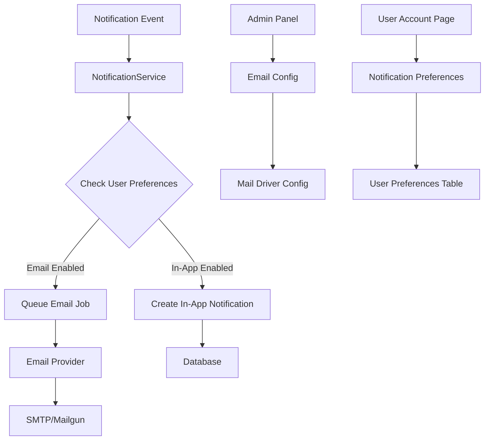

# Email Notifications System - Design Document

## Overview

The email notifications system extends the existing notification infrastructure to support email delivery alongside in-app notifications. The design leverages Laravel's built-in mail system with configurable drivers (SMTP/Mailgun), file-based templates for future multilingual support, and user preference management through both the frontend account page and backend admin panel.

## Architecture

### High-Level Architecture



### Database Schema Changes

#### New Tables

**notification_preferences**
```sql
CREATE TABLE notification_preferences (
    id BIGINT PRIMARY KEY AUTO_INCREMENT,
    user_id BIGINT NOT NULL,
    notification_type VARCHAR(255) NOT NULL,
    email_enabled BOOLEAN DEFAULT true,
    in_app_enabled BOOLEAN DEFAULT true,
    created_at TIMESTAMP,
    updated_at TIMESTAMP,
    FOREIGN KEY (user_id) REFERENCES users(id) ON DELETE CASCADE,
    UNIQUE KEY unique_user_notification_type (user_id, notification_type)
);
```

**email_configurations**
```sql
CREATE TABLE email_configurations (
    id BIGINT PRIMARY KEY AUTO_INCREMENT,
    provider VARCHAR(50) NOT NULL, -- 'smtp' or 'mailgun'
    is_active BOOLEAN DEFAULT false,
    config JSON NOT NULL, -- Provider-specific configuration
    created_at TIMESTAMP,
    updated_at TIMESTAMP
);
```

#### Enhanced Notifications Table
The existing notifications table already has delivery tracking fields (`delivered_at`, `failed_at`, `failure_reason`) which will be used for email delivery status.

## Components and Interfaces

### Backend Components

#### 1. NotificationService
**Location:** `app/Services/NotificationService.php`

```php
class NotificationService
{
    public function send(User $user, string $type, array $data): void
    public function sendEmail(User $user, string $type, array $data): void
    public function sendInApp(User $user, string $type, array $data): void
    private function getUserPreferences(User $user, string $type): NotificationPreference
}
```

#### 2. EmailConfigurationService
**Location:** `app/Services/EmailConfigurationService.php`

```php
class EmailConfigurationService
{
    public function getActiveConfiguration(): ?EmailConfiguration
    public function setActiveConfiguration(string $provider, array $config): void
    public function testConfiguration(array $config): bool
    public function updateMailConfig(): void
}
```

#### 3. Mail Classes
**Location:** `app/Mail/`

```php
// Base class for all notification emails
abstract class NotificationMail extends Mailable
{
    protected function getTemplate(): string
    protected function getSubject(): string
    protected function getData(): array
}

// Specific notification emails
class PlacementRequestResponseMail extends NotificationMail
class PlacementRequestAcceptedMail extends NotificationMail
class HelperResponseAcceptedMail extends NotificationMail
class HelperResponseRejectedMail extends NotificationMail
```

#### 4. Jobs
**Location:** `app/Jobs/`

```php
class SendNotificationEmail implements ShouldQueue
{
    public function handle(): void
    public function failed(Throwable $exception): void
}
```

#### 5. Models

**NotificationPreference Model**
```php
class NotificationPreference extends Model
{
    protected $fillable = ['user_id', 'notification_type', 'email_enabled', 'in_app_enabled'];
    
    public function user(): BelongsTo
    public static function getPreference(User $user, string $type): self
    public static function updatePreference(User $user, string $type, bool $email, bool $inApp): void
}
```

**EmailConfiguration Model**
```php
class EmailConfiguration extends Model
{
    protected $fillable = ['provider', 'is_active', 'config'];
    protected $casts = ['config' => 'array', 'is_active' => 'boolean'];
    
    public static function getActive(): ?self
    public function activate(): void
    public function getMailConfig(): array
}
```

#### 6. Filament Resources

**EmailConfigurationResource**
**Location:** `app/Filament/Resources/EmailConfigurationResource.php`

- Form with provider selection (SMTP/Mailgun)
- Dynamic form fields based on provider
- Test connection functionality
- Activation/deactivation controls

### Frontend Components

#### 1. NotificationPreferences Component
**Location:** `frontend/src/components/NotificationPreferences.tsx`

```typescript
interface NotificationPreference {
  type: string;
  label: string;
  emailEnabled: boolean;
  inAppEnabled: boolean;
}

export function NotificationPreferences() {
  // Table with notification types and toggle switches
  // Real-time preference updates
  // Loading states and error handling
}
```

#### 2. Account Page Integration
**Location:** `frontend/src/pages/account/NotificationsPage.tsx`

Integration into the existing account page structure with a dedicated notifications section.

### Email Templates

#### Template Structure
**Location:** `resources/views/emails/notifications/`

```
resources/views/emails/notifications/
├── layout.blade.php                    # Base email layout
├── placement-request-response.blade.php # Owner: Response to placement request
├── placement-request-accepted.blade.php # Owner: Request accepted
├── helper-response-accepted.blade.php   # Helper: Response accepted
└── helper-response-rejected.blade.php   # Helper: Response rejected
```

#### Template Variables
Each template will receive:
- `$user` - Recipient user object
- `$notification` - Notification data
- `$cat` - Related cat object (if applicable)
- `$helper` - Related helper profile (if applicable)
- `$actionUrl` - Deep link to relevant page

## Data Models

### Notification Types
```php
enum NotificationType: string
{
    case PLACEMENT_REQUEST_RESPONSE = 'placement_request_response';
    case PLACEMENT_REQUEST_ACCEPTED = 'placement_request_accepted';
    case HELPER_RESPONSE_ACCEPTED = 'helper_response_accepted';
    case HELPER_RESPONSE_REJECTED = 'helper_response_rejected';
    
    public function getGroup(): string
    {
        return match($this) {
            self::PLACEMENT_REQUEST_RESPONSE,
            self::PLACEMENT_REQUEST_ACCEPTED,
            self::HELPER_RESPONSE_ACCEPTED,
            self::HELPER_RESPONSE_REJECTED => 'helper_profile',
        };
    }
    
    public function getLabel(): string
    {
        return match($this) {
            self::PLACEMENT_REQUEST_RESPONSE => 'Response to Placement Request',
            self::PLACEMENT_REQUEST_ACCEPTED => 'Placement Request Accepted',
            self::HELPER_RESPONSE_ACCEPTED => 'Helper Response Accepted',
            self::HELPER_RESPONSE_REJECTED => 'Helper Response Rejected',
        };
    }
}
```

### Email Provider Configuration Schema

#### SMTP Configuration
```json
{
  "host": "smtp.gmail.com",
  "port": 587,
  "username": "user@example.com",
  "password": "app_password",
  "encryption": "tls",
  "from_address": "noreply@meomaimoi.com",
  "from_name": "Meo Mai Moi"
}
```

#### Mailgun Configuration
```json
{
  "domain": "mg.meomaimoi.com",
  "api_key": "key-xxxxx",
  "endpoint": "api.mailgun.net",
  "from_address": "noreply@meomaimoi.com",
  "from_name": "Meo Mai Moi"
}
```

## Error Handling

### Email Delivery Failures
1. **Queue Retry Logic:** Failed email jobs will retry up to 3 times with exponential backoff
2. **Failure Logging:** All failures logged with detailed error information
3. **Notification Updates:** Failed deliveries update the notification record with failure reason
4. **Admin Alerts:** Critical failures (configuration issues) trigger admin notifications
5. **Graceful Degradation:** Email failures don't prevent in-app notifications

### Configuration Validation
1. **Real-time Testing:** Configuration changes tested before saving
2. **Fallback Handling:** Invalid configurations disable email sending temporarily
3. **User Feedback:** Clear error messages for configuration issues

### User Experience
1. **Preference Persistence:** Failed preference updates show error messages and revert UI
2. **Loading States:** Clear loading indicators during preference updates
3. **Offline Handling:** Preference changes queued when offline

## Testing Strategy

### Backend Testing

#### Unit Tests
- `NotificationServiceTest`: Test notification routing logic
- `EmailConfigurationServiceTest`: Test configuration management
- `NotificationPreferenceTest`: Test preference model methods
- `NotificationMailTest`: Test email content generation

#### Feature Tests
- `EmailNotificationDeliveryTest`: End-to-end email sending
- `NotificationPreferenceApiTest`: API endpoint testing
- `EmailConfigurationApiTest`: Admin configuration testing
- `NotificationIntegrationTest`: Full notification flow testing

#### Queue Testing
- `SendNotificationEmailJobTest`: Test job execution and failure handling
- `EmailDeliveryTrackingTest`: Test delivery status updates

### Frontend Testing

#### Component Tests
- `NotificationPreferences.test.tsx`: Preference UI interactions
- `NotificationPreferencesApi.test.tsx`: API integration testing

#### Integration Tests
- `AccountPageNotifications.test.tsx`: Full account page integration
- `NotificationPreferencesFlow.test.tsx`: End-to-end preference management

### Email Template Testing
- Template rendering with various data scenarios
- HTML/text format validation
- Link generation and unsubscribe functionality

### Configuration Testing
- SMTP connection testing with various providers
- Mailgun API integration testing
- Configuration validation and error handling

## Security Considerations

### Email Configuration Security
1. **Encrypted Storage:** Sensitive configuration data encrypted in database
2. **Access Control:** Only admin users can modify email configurations
3. **Audit Logging:** All configuration changes logged for security audit

### User Privacy
1. **Opt-out Mechanisms:** Clear unsubscribe links in all emails
2. **Data Minimization:** Only necessary data included in email templates
3. **Preference Respect:** Strict adherence to user notification preferences

### Email Security
1. **SPF/DKIM:** Proper email authentication setup documentation
2. **Rate Limiting:** Email sending rate limits to prevent abuse
3. **Content Sanitization:** All dynamic content properly escaped in templates

## Performance Considerations

### Queue Management
1. **Async Processing:** All email sending handled via queues
2. **Queue Monitoring:** Admin dashboard shows queue status and failures
3. **Resource Limits:** Configurable email sending rate limits

### Database Optimization
1. **Indexed Queries:** Proper indexing on notification preferences lookups
2. **Preference Caching:** User preferences cached for performance
3. **Cleanup Jobs:** Automated cleanup of old notification records

### Template Performance
1. **Template Caching:** Blade template caching enabled
2. **Asset Optimization:** Email assets optimized for size
3. **Lazy Loading:** Non-critical email data loaded lazily

## Migration Strategy

### Database Migrations
1. **Preference Migration:** Create default preferences for existing users
2. **Configuration Migration:** Set up default email configuration
3. **Backward Compatibility:** Existing notification system continues working during migration

### Feature Rollout
1. **Admin Configuration First:** Email configuration available before user preferences
2. **Gradual User Rollout:** Notification preferences rolled out to user groups
3. **Monitoring:** Extensive monitoring during initial rollout

### Rollback Plan
1. **Feature Flags:** Email notifications can be disabled via configuration
2. **Database Rollback:** Migration rollback procedures documented
3. **Fallback Mode:** System falls back to in-app notifications only if needed