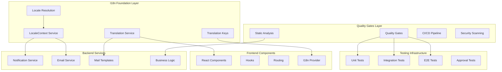

# Design Document

## Overview

The multilanguage preparation feature establishes a comprehensive foundation for internationalization (i18n) by implementing quality gates, testing infrastructure, architectural improvements, and translation-ready systems. This design focuses on creating a maintainable, well-tested codebase that can seamlessly support multiple languages without technical debt.

The approach is structured in phases: baseline establishment, quality assurance implementation, test infrastructure enhancement, i18n architecture foundation, and validation. Each phase builds upon the previous one to ensure a solid foundation for future multilanguage support.

## Architecture

### High-Level System Design



### Layer Boundaries and Dependencies

The design enforces strict architectural boundaries:

1. **Presentation Layer**: Controllers, Resources, Components
2. **Business Logic Layer**: Services, Domain Models
3. **Data Access Layer**: Repositories, Models, Database
4. **Infrastructure Layer**: Mail, Notifications, External APIs

Dependencies flow downward only, with no circular dependencies between layers.

## Components and Interfaces

### Backend Components

#### LocaleContext Service

```php
interface LocaleContextInterface
{
    public function resolveLocale(Request $request, ?User $user = null): string;
    public function setLocale(string $locale): void;
    public function getAvailableLocales(): array;
    public function isLocaleSupported(string $locale): bool;
    public function getFallbackLocale(): string;
}
```

**Responsibilities:**
- Resolve user locale from preferences, Accept-Language header, or default
- Validate locale support and provide fallback mechanisms
- Maintain locale context throughout request lifecycle

#### Translation Service

```php
interface TranslationServiceInterface
{
    public function translate(string $key, array $parameters = [], ?string $locale = null): string;
    public function translateTemplate(string $templateKey, array $variables = [], ?string $locale = null): array;
    public function hasTranslation(string $key, ?string $locale = null): bool;
    public function getTranslationKeys(string $namespace = null): array;
}
```

**Responsibilities:**
- Provide key-based translation with variable substitution
- Support template-based translations for emails and notifications
- Handle missing translations with logging and fallback

#### Enhanced Notification Service

The existing `NotificationService` will be extended to support locale-aware notifications:

```php
class NotificationService
{
    public function send(User $user, string $type, array $data, ?string $locale = null): void;
    public function sendEmail(User $user, string $type, array $data, ?string $locale = null): bool;
    public function sendInApp(User $user, string $type, array $data, ?string $locale = null): bool;
}
```

#### Email Template Abstraction

```php
interface EmailTemplateInterface
{
    public function render(string $templateKey, array $variables, string $locale): string;
    public function getSubject(string $templateKey, array $variables, string $locale): string;
    public function getAvailableTemplates(): array;
}
```

### Frontend Components

#### I18n Provider and Context

```typescript
interface I18nContextType {
  locale: string;
  setLocale: (locale: string) => void;
  t: (key: string, variables?: Record<string, any>) => string;
  availableLocales: string[];
  isLoading: boolean;
}

interface TranslationHook {
  t: (key: string, variables?: Record<string, any>) => string;
  locale: string;
  changeLocale: (locale: string) => Promise<void>;
}
```

#### Translation Key Management

```typescript
interface TranslationKeys {
  auth: {
    login: string;
    register: string;
    forgotPassword: string;
    // ... other auth keys
  };
  pets: {
    create: string;
    edit: string;
    delete: string;
    // ... other pet keys
  };
  notifications: {
    success: string;
    error: string;
    // ... other notification keys
  };
}
```

### Quality Assurance Components

#### Static Analysis Configuration

**PHPStan Configuration** (`phpstan.neon`):
```neon
parameters:
    level: 7
    paths:
        - app
        - tests
    excludePaths:
        - app/Console/Kernel.php
    checkMissingIterableValueType: false
    checkGenericClassInNonGenericObjectType: false
```

**Deptrac Configuration** (`deptrac.yaml`):
```yaml
deptrac:
  layers:
    - name: Controller
      collectors:
        - type: className
          regex: .*Controller.*
    - name: Service
      collectors:
        - type: className
          regex: .*Service.*
    - name: Model
      collectors:
        - type: className
          regex: .*Models.*
  ruleset:
    Controller:
      - Service
    Service:
      - Model
    Model: []
```

#### Test Infrastructure Components

**Centralized Test Utilities**:
```typescript
// test/utils/renderWithProviders.tsx
export function renderWithProviders(
  ui: React.ReactElement,
  options?: {
    initialEntries?: string[];
    user?: User;
    locale?: string;
  }
): RenderResult;
```

**MSW Server Setup**:
```typescript
// test/server.ts
export const server = setupServer(
  ...handlers
);

export function setupTestServer(): void;
export function resetTestServer(): void;
```

## Data Models

### Translation Storage Schema

```sql
-- Translation keys and values (if DB-based approach is chosen)
CREATE TABLE translations (
    id BIGSERIAL PRIMARY KEY,
    key VARCHAR(255) NOT NULL,
    locale VARCHAR(10) NOT NULL,
    value TEXT NOT NULL,
    namespace VARCHAR(100),
    created_at TIMESTAMP DEFAULT CURRENT_TIMESTAMP,
    updated_at TIMESTAMP DEFAULT CURRENT_TIMESTAMP,
    UNIQUE(key, locale, namespace)
);

-- User locale preferences
ALTER TABLE users ADD COLUMN preferred_locale VARCHAR(10) DEFAULT 'en';

-- Email template tracking
CREATE TABLE email_templates (
    id BIGSERIAL PRIMARY KEY,
    template_key VARCHAR(255) NOT NULL,
    locale VARCHAR(10) NOT NULL,
    subject_template TEXT NOT NULL,
    body_template TEXT NOT NULL,
    variables JSONB,
    created_at TIMESTAMP DEFAULT CURRENT_TIMESTAMP,
    updated_at TIMESTAMP DEFAULT CURRENT_TIMESTAMP,
    UNIQUE(template_key, locale)
);
```

### Configuration Models

```php
class LocaleConfiguration
{
    public string $defaultLocale;
    public array $supportedLocales;
    public array $fallbackChain;
    public bool $detectFromBrowser;
    public bool $storeUserPreference;
}
```

## Error Handling

### Translation Error Handling Strategy

1. **Missing Translation Keys**:
   - Log missing key with context (locale, namespace, fallback used)
   - Return fallback translation or key itself in development
   - Emit metrics for monitoring translation coverage

2. **Locale Resolution Failures**:
   - Fall back to default locale gracefully
   - Log resolution attempts and failures
   - Maintain user experience without errors

3. **Template Rendering Errors**:
   - Use fallback templates for critical communications
   - Log template errors with full context
   - Ensure email delivery continues with basic templates

### Error Monitoring and Logging

```php
// Translation error logging
Log::warning('Translation key missing', [
    'key' => $translationKey,
    'locale' => $requestedLocale,
    'fallback_used' => $fallbackLocale,
    'user_id' => $userId,
    'request_id' => $requestId
]);

// Template rendering error logging
Log::error('Email template rendering failed', [
    'template_key' => $templateKey,
    'locale' => $locale,
    'variables' => $variables,
    'error' => $exception->getMessage(),
    'fallback_template' => $fallbackTemplate
]);
```

## Testing Strategy

### Test Pyramid Structure

1. **Unit Tests (70%)**:
   - Service layer logic
   - Translation key resolution
   - Locale context management
   - Email template rendering
   - Business logic validation

2. **Integration Tests (20%)**:
   - Database interactions
   - Email sending workflows
   - API endpoint responses
   - Service layer interactions

3. **End-to-End Tests (10%)**:
   - Critical user flows
   - Locale switching behavior
   - Email delivery verification
   - Cross-browser compatibility

### Approval Testing Strategy

**Email Template Approval Tests**:
```php
class EmailTemplateApprovalTest extends TestCase
{
    public function test_notification_email_template_rendering()
    {
        $user = User::factory()->create();
        $data = ['pet_name' => 'Fluffy', 'action' => 'adopted'];
        
        $mail = new NotificationMail($user, NotificationType::PET_ADOPTED, $data);
        $rendered = $mail->render();
        
        $this->assertMatchesSnapshot($rendered->getBody());
        $this->assertMatchesSnapshot($rendered->getSubject());
    }
}
```

**Frontend Component Approval Tests**:
```typescript
describe('LoginForm Approval Tests', () => {
  it('should match approved structure', () => {
    const { container } = renderWithProviders(<LoginForm />);
    expect(container.firstChild).toMatchSnapshot();
  });
});
```

### Performance Testing

1. **Translation Loading Performance**:
   - Measure locale resource loading times
   - Test lazy loading effectiveness
   - Validate caching mechanisms

2. **Email Template Rendering Performance**:
   - Benchmark template compilation times
   - Test variable substitution performance
   - Measure memory usage during bulk operations

### Mutation Testing Strategy

Focus mutation testing on critical business logic:
- Translation key resolution
- Locale fallback mechanisms
- Email template variable substitution
- User preference handling

## Implementation Phases

### Phase 1: Foundation and Quality Gates (Weeks 1-2)
- Set up static analysis tools (PHPStan, ESLint strict rules)
- Implement dependency analysis (Deptrac, dependency-cruiser)
- Add security scanning and pre-commit hooks
- Establish baseline metrics and coverage reports

### Phase 2: Test Infrastructure Enhancement (Weeks 2-3)
- Restructure test suites with proper separation
- Add centralized test utilities and MSW setup
- Implement approval testing framework
- Set up Playwright E2E testing infrastructure

### Phase 3: I18n Architecture Foundation (Weeks 3-4)
- Implement LocaleContext service and middleware
- Create Translation service interface and stub implementation
- Abstract email template system for key-based rendering
- Add frontend i18n provider and translation hooks

### Phase 4: Code Quality and Architecture (Weeks 4-5)
- Extract business logic from controllers to services
- Enforce architectural boundaries via Deptrac rules
- Centralize formatting utilities and remove hardcoded strings
- Implement proper error handling and logging

### Phase 5: Validation and Second Locale (Week 5-6)
- Validate all quality gates and architectural boundaries
- Add second locale scaffold with partial translations
- Test locale switching and fallback mechanisms
- Document translation workflows and success criteria

This phased approach ensures each component is properly tested and validated before moving to the next phase, reducing risk and maintaining system stability throughout the preparation process.