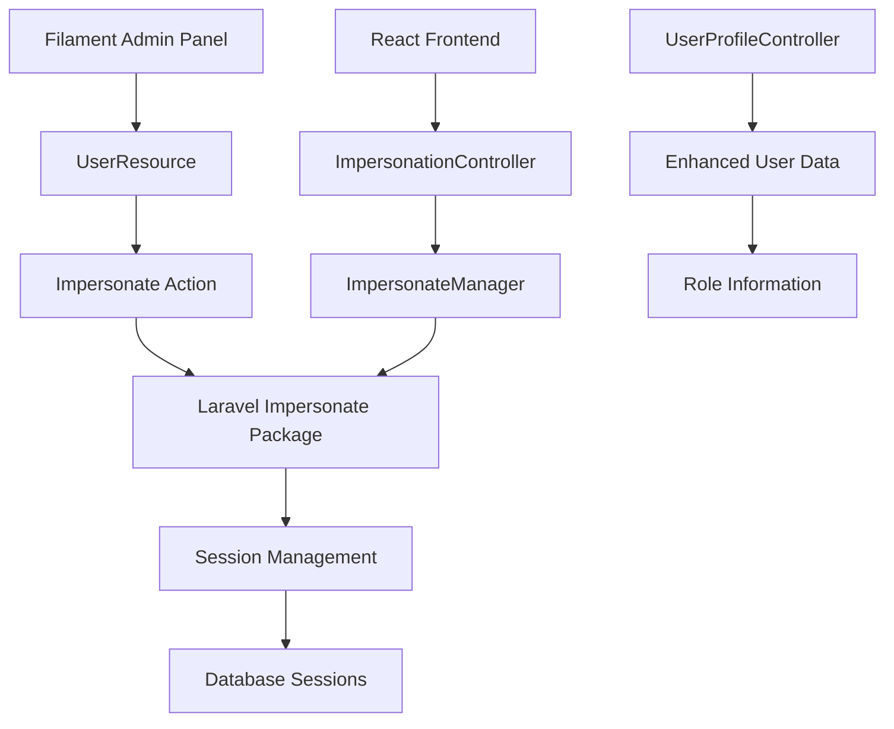
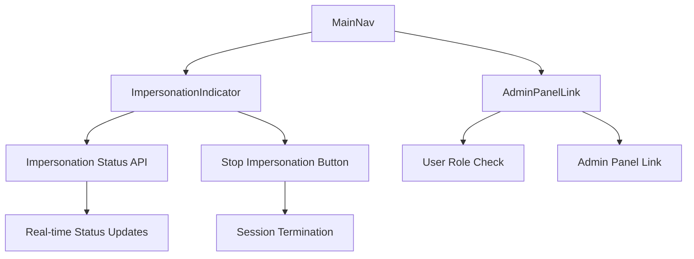

# User Impersonation System Design

## Overview

The User Impersonation System is built on top of Laravel's session management and the `lab404/laravel-impersonate` package, integrated with Filament admin panel and a React frontend. The system provides secure, auditable user impersonation with clear visual indicators and easy session management.

## Architecture

### Backend Components



### Frontend Components



## Components and Interfaces

### Backend API Endpoints

#### GET /api/impersonation/status
Returns current impersonation status and user information.

**Response:**
```json
{
  "is_impersonating": true,
  "impersonator": {
    "id": 1,
    "name": "Super Admin",
    "can_access_admin": true
  },
  "impersonated_user": {
    "id": 5,
    "name": "Regular User"
  }
}
```

#### POST /api/impersonation/leave
Terminates the current impersonation session.

**Response:**
```json
{
  "message": "Impersonation ended"
}
```

#### Enhanced GET /api/users/me
Includes role and admin access information.

**Response:**
```json
{
  "data": {
    "id": 1,
    "name": "Super Admin",
    "email": "admin@catarchy.space",
    "can_access_admin": true,
    "roles": ["super_admin"]
  }
}
```

### Frontend Components

#### ImpersonationIndicator
- Displays current impersonation status
- Shows impersonated user name
- Provides "Stop Impersonating" functionality
- Auto-refreshes status every 30 seconds
- Responsive design for mobile/desktop

#### AdminPanelLink
- Shows admin panel access for authorized users
- Opens admin panel in new tab
- Only visible to users with admin/super_admin roles
- Integrates with impersonation indicator

### Filament Integration

#### UserResource Enhancement
- Adds impersonation action to user table
- Integrates with `stechstudio/filament-impersonate`
- Respects user permissions for impersonation access
- Provides visual impersonation trigger

## Data Models

### User Model Extensions
The existing User model is enhanced with:
- `canImpersonate()`: Determines if user can impersonate others
- `canBeImpersonated()`: Determines if user can be impersonated
- Role relationship loading for permission checks

### Session Data
Impersonation state is managed through Laravel sessions:
- `impersonate.impersonator_id`: Original admin user ID
- Standard Laravel session management for security

## Error Handling

### Backend Error Scenarios
1. **Unauthorized Impersonation**: Return 403 Forbidden
2. **Invalid User Target**: Return 404 Not Found  
3. **Session Corruption**: Safely return to login
4. **Permission Changes**: Validate permissions on each request

### Frontend Error Handling
1. **API Failures**: Show user-friendly error messages
2. **Network Issues**: Graceful degradation with retry logic
3. **Session Expiry**: Redirect to login with context preservation
4. **Invalid State**: Reset to safe default state

## Testing Strategy

### Backend Testing
- Unit tests for ImpersonationController endpoints
- Integration tests for session management
- Policy tests for permission validation
- Feature tests for complete impersonation workflows

### Frontend Testing
- Component tests for ImpersonationIndicator
- Integration tests for API interactions
- E2E tests for complete impersonation flows
- Responsive design tests for mobile/desktop

### Security Testing
- Permission boundary testing
- Session security validation
- Cross-user data access prevention
- Audit trail verification

## Security Considerations

### Access Control
- Role-based impersonation permissions
- Prevention of privilege escalation
- Audit logging for all impersonation events
- Session security during transitions

### Data Protection
- No sensitive data exposure during impersonation
- Proper session isolation
- Secure session termination
- Protection against session hijacking

### Audit Requirements
- Log impersonation start/end events
- Track impersonated user actions
- Maintain admin accountability
- Support compliance requirements